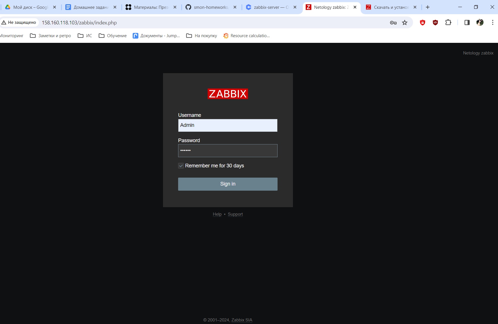
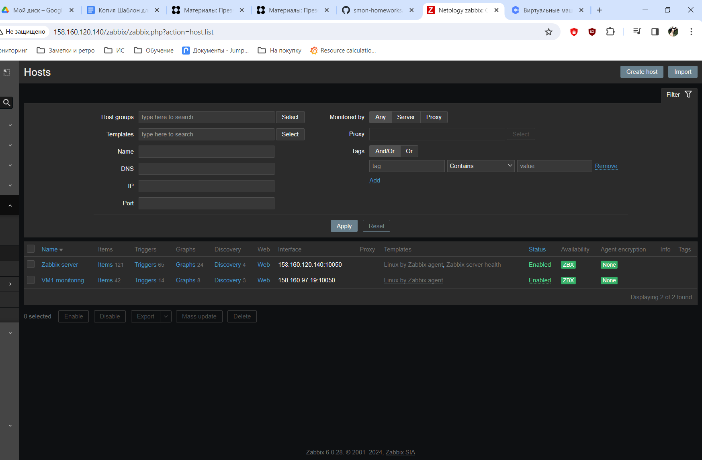
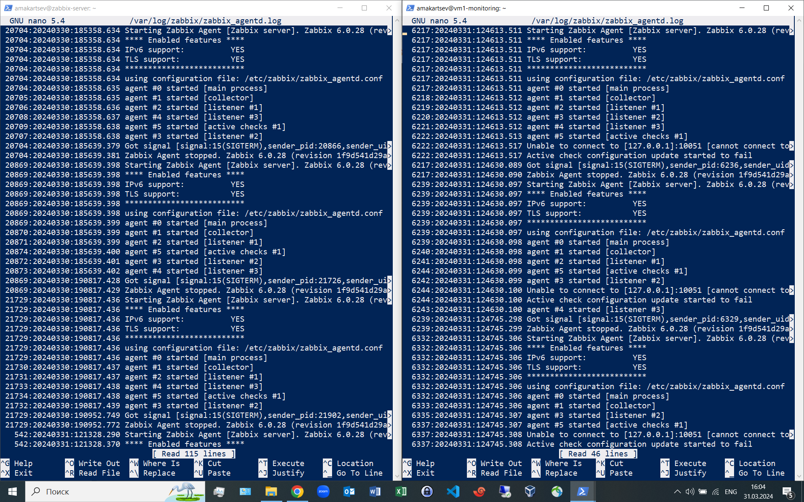
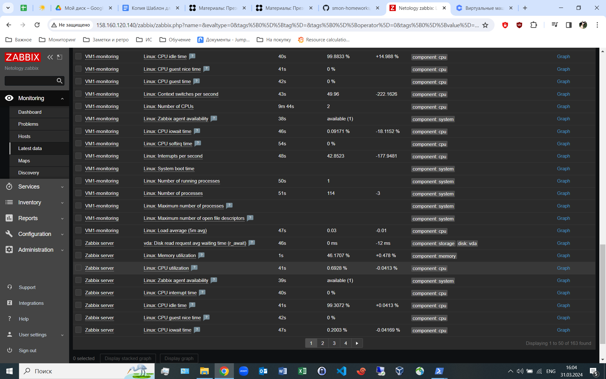

# Домашнее задание к занятию «Система мониторинга Zabbix» "Макарцев Александр Владимирович"

В практике есть 2 основных и 1 дополнительное (со звездочкой) задания. Первые два нужно выполнять обязательно, третье - по желанию и его решение никак не повлияет на получение вами зачета по этому домашнему заданию, при этом вы сможете глубже и/или шире разобраться в материале. 

Пожалуйста, присылайте на проверку всю задачу сразу. Любые вопросы по решению задач задавайте в чате учебной группы.

### Цели задания
1. Научиться устанавливать Zabbix Server c веб-интерфейсом
2. Научиться устанавливать Zabbix Agent на хосты
3. Научиться устанавливать Zabbix Agent на компьютер и подключать его к серверу Zabbix 

### Чеклист готовности к домашнему заданию
- [ ] Просмотрите в личном кабинете занятие "Система мониторинга Zabbix" 

---

### Задание 1 

Установите Zabbix Server с веб-интерфейсом.

#### Процесс выполнения
1. Выполняя ДЗ, сверяйтесь с процессом отражённым в записи лекции.
2. Установите PostgreSQL. Для установки достаточна та версия, что есть в системном репозитороии Debian 11.
3. Пользуясь конфигуратором команд с официального сайта, составьте набор команд для установки последней версии Zabbix с поддержкой PostgreSQL и Apache.
4. Выполните все необходимые команды для установки Zabbix Server и Zabbix Web Server.

#### Требования к результаты 
1. Прикрепите в файл README.md скриншот авторизации в админке.
2. Приложите в файл README.md текст использованных команд в GitHub.

#### Решение 
1. Устанавливаю Postgresql:
```bash
sudo apt update
```
```bash
sudo apt -y install postgresql
```
2. Устанавливаю репозиторий Zabbix:
```bash
wget https://repo.zabbix.com/zabbix/6.0/debian/pool/main/z/zabbix-release/zabbix-release_6.0-4+debian11_all.deb
```
```bash
sudo dpkg -i zabbix-release_6.0-4+debian11_all.deb
```
```bash
sudo apt update
```
3. Устанавливаю Zabbix сервер, веб-интерфейс:
```bash
sudo apt install zabbix-server-pgsql zabbix-frontend-php php7.4-pgsql zabbix-apache-conf zabbix-sql-scripts
```
4. Создаю пользователя и БД:
```bash
sudo -u postgres createuser --pwprompt zabbix
```
```bash
sudo -u postgres createdb -O zabbix zabbix
```
5. Импортирую начальную схему и данные:
```bash
zcat /usr/share/zabbix-sql-scripts/postgresql/server.sql.gz | sudo -u zabbix psql zabbix
```
6. Редактирую файл файл /etc/zabbix/zabbix_server.conf :
```
DBPassword=password
```
7. Запускаю процессы Zabbix сервера и агента и настраиваю их запуск при загрузке ОС:
```bash
systemctl restart zabbix-server apache2
```
```bash
systemctl enable zabbix-server apache2
```

---

### Задание 2 

Установите Zabbix Agent на два хоста.

#### Процесс выполнения
1. Выполняя ДЗ, сверяйтесь с процессом отражённым в записи лекции.
2. Установите Zabbix Agent на 2 вирт.машины, одной из них может быть ваш Zabbix Server.
3. Добавьте Zabbix Server в список разрешенных серверов ваших Zabbix Agentов.
4. Добавьте Zabbix Agentов в раздел Configuration > Hosts вашего Zabbix Servera.
5. Проверьте, что в разделе Latest Data начали появляться данные с добавленных агентов.

#### Требования к результаты 
1. Приложите в файл README.md скриншот раздела Configuration > Hosts, где видно, что агенты подключены к серверу
2. Приложите в файл README.md скриншот лога zabbix agent, где видно, что он работает с сервером
3. Приложите в файл README.md скриншот раздела Monitoring > Latest data для обоих хостов, где видны поступающие от агентов данные.
4. Приложите в файл README.md текст использованных команд в GitHub

#### Решение
1. Устанавливаю репозиторий Zabbix на оба хоста:
```bash
wget https://repo.zabbix.com/zabbix/6.0/debian/pool/main/z/zabbix-release/zabbix-release_6.0-4+debian11_all.deb
```
```bash
dpkg -i zabbix-release_6.0-4+debian11_all.deb
```
```bash
sudo apt update
```
2. Устанавливаю Zabbix-agent на оба хоста:
```bash
sudo apt install zabbix-agent
```
3. Добавляю адрес zabbix-server в zabbix_agentd.conf на обоих хостах:
```bash
sudo nano /etc/zabbix/zabbix_agentd.conf
```
4. Рестарт и автозапуск Zabbix-agent на обоих хостах:
```bash
sudo systemctl restart zabbix-agent
```
```bash
sudo systemctl enable zabbix-agent
```




---
## Задание 3 со звёздочкой*
Установите Zabbix Agent на Windows (компьютер) и подключите его к серверу Zabbix.

#### Требования к результаты 
1. Приложите в файл README.md скриншот раздела Latest Data, где видно свободное место на диске C:
--- 

## Критерии оценки

1. Выполнено минимум 2 обязательных задания
2. Прикреплены требуемые скриншоты и тексты 
3. Задание оформлено в шаблоне с решением и опубликовано на GitHub